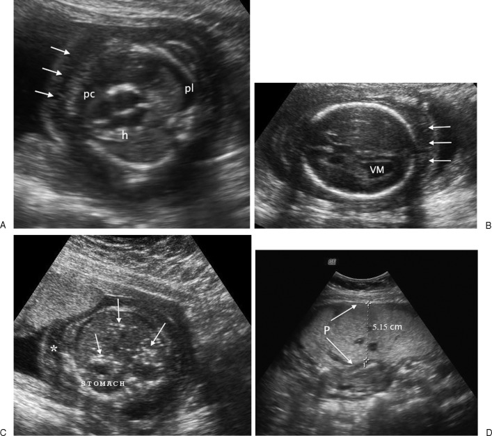

# Fetal Health Classification Using Machine Learning


This project classifies fetal health status from cardiotocogram (CTG) features using machine learning. The model predicts whether a fetus is **Normal**, **Suspect**, or **Pathological** to support early clinical decision-making.


## Project Overview

Cardiotocograms are commonly used in prenatal care to monitor fetal well-being. This project builds an end-to-end pipeline for exploring the data, training a classifier, tuning its hyperparameters, and saving the final model for reuse.

## Dataset

- Source:https://www.kaggle.com/datasets/andrewmvd/fetal-health-classification
- Samples: 2,126 records
- Features: 22 CTG-based features
- Target variable: `fetal_health`

### Classes

- 1: Normal
- 2: Suspect
- 3: Pathological

## Project Workflow

### 1. Data Loading and Exploration

- Loaded the dataset and checked its structure
- Visualized class balance and correlations
- Reviewed the feature distribution across classes

### 2. Data Preprocessing

- Handled missing and infinite values
- Applied feature scaling where needed

### 3. Model Training

- Trained a baseline Random Forest classifier
- Evaluated the model using a confusion matrix and classification report

### 4. Hyperparameter Tuning

- Used GridSearchCV to optimize the Random Forest model

### 5. Final Evaluation

- Evaluated the tuned model
- Reviewed feature importance for interpretability

### 6. Model Saving

- Saved the trained model as `optimized_fetal_model.pkl`

## Feature Descriptions

### Heart Activity

- Baseline Value: Average fetal heart rate
- Accelerations: Temporary increases in heart rate
- Fetal Movement: Movement activity of the fetus
- Uterine Contractions: Frequency of contractions

### Decelerations

- Light Decelerations: Mild drops in heart rate
- Severe Decelerations: Large drops that may indicate distress
- Prolonged Decelerations: Long-lasting drops in heart rate

### Variability Features

- Short-term and long-term heart rate variability
- Measures consistency in fetal heart activity

### Histogram Features

- Mean, median, variance
- Minimum and maximum values
- Number of peaks and zeroes
- Tendency and other distribution measures

## Results

- Best model: Optimized Random Forest Classifier
- Accuracy: 95.3%
- ROC-AUC score: 0.97

### Most Important Features

- Baseline Value
- Accelerations
- Histogram Mean
- Fetal Movement

## Visualizations

This project includes:

- Correlation heatmap
- Feature distribution plots
- Boxplots for outlier detection
- Feature importance graph

## How to Run the Project

### 1. Clone the repository


git https://github.com/kAWAMIRIA23/FETO-GUARD.git
cd feto guard


### 2. Install dependencies

```bash
pip install -r requirements.txt
```

### 3. Open the notebook

```bash
jupyter notebook KAWANGUZI_MARIA_MIRIA_UGANDA_FINAL_PROJECT.ipynb
```

## Technologies Used

- Python
- Pandas and NumPy for data processing
- Matplotlib and Seaborn for visualization
- Scikit-learn for machine learning
- Jupyter Notebook for analysis

## Future Work – FetoGuard Vision

Building on the success of CTG-based prediction, the FetoGuard system can be further enhanced by incorporating ultrasound (sonogram) imaging with machine learning techniques.

In the future and even now , machine learning models can be trained on ultrasound images to automatically detect structural abnormalities in the fetus. Unlike CTG data, which focuses on heart rate patterns, ultrasound imaging provides visual and anatomical information, enabling the detection of conditions such as:

- Abnormal fetal growth patterns
- Structural deformities
- Organ development issues

By combining CTG data (functional analysis) with ultrasound imaging (structural analysis), FetoGuard can evolve into a more comprehensive diagnostic system. This multimodal approach would significantly improve accuracy, allowing earlier and more precise detection of fetal abnormalities.

Ultimately, integrating these technologies has the potential to transform prenatal care into a smarter, data-driven system that enhances early diagnosis, reduces risks, and improves outcomes for both mother and child.



## In Conclusion
This project is a personal journey. I have seen the pain of losing babies in my own family losses that came without warning, and without answers in time.

Feto Guard is built from that place of loss, but also from hope, that technology can help detect risks earlier, support doctors, and give more families a chance at healthy outcomes.

Even if it helps just one life, then it matters.

 Inspired by the role of machine learning in healthcare

THANK YOU KUJENGA
